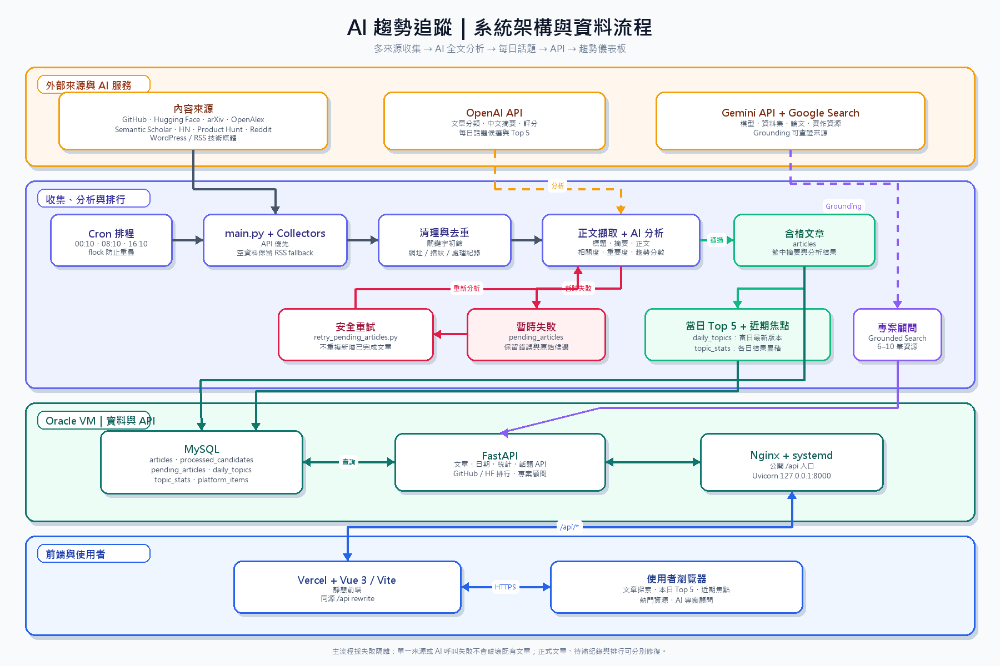

# AI 趨勢追蹤

整合多來源 AI 技術資訊、模型與研究資源，透過自動化收集、全文分析、去重與話題排行，提供可持續更新的 AI 趨勢儀表板。

## 專案結構

```text
AI_Trend/
├── backend/
│   └── app.py                         # FastAPI 路由與查詢 API
├── docs/
│   ├── ai-trend-architecture.drawio  # 可編輯的系統架構圖
│   └── ai-trend-architecture.png     # README 顯示用架構圖
├── frontend/
│   ├── src/
│   │   ├── App.vue                   # 主要頁面與互動
│   │   ├── api.js                    # 前端 API 呼叫
│   │   └── styles.css                # 全站樣式
│   ├── package.json
│   └── vite.config.js
├── api_collectors.py                 # API 資料來源收集器
├── api_sources.py                    # API 來源設定
├── article_content.py                # 文章正文擷取
├── cleaning.py                       # 關鍵字判斷與標準化
├── database.py                       # SQLite／MySQL 資料層與 schema
├── Github_Huggingface_collector.py   # GitHub／Hugging Face 熱門資源
├── main.py                           # 爬蟲與分析主流程
├── project_advisor.py                # Gemini 搜尋型專案顧問
├── retry_pending_articles.py         # 失敗文章重試
├── rss_sources.py                    # RSS 來源設定
├── summarizer.py                     # OpenAI 文章分析
├── topic_rankings.py                 # 本日 Top 5 與近期焦點
├── test_pipeline_logic.py            # 核心流程測試
├── DEPLOYMENT.md                     # 完整部署與維運手冊
├── requirements.txt
└── vercel.json
```

## 系統架構圖



資料收集以 API 為優先，API 無有效資料時保留 RSS fallback。候選文章先經本地相關性判斷與去重，再擷取正文交由 OpenAI 分析；成功文章寫入資料庫並更新當日 Top 5，暫時失敗的文章則保留至待補流程。前端透過 Vercel 的同源 `/api` 路徑存取 Oracle 上的 FastAPI。

## 技術棧

| 層級 | 技術 |
| --- | --- |
| 前端 | Vue 3、Vite、JavaScript、CSS |
| API | FastAPI、Uvicorn |
| 資料收集 | Python、Feedparser、REST API、RSS |
| AI 分析 | OpenAI API、Gemini API、Google Search Grounding |
| 資料庫 | MySQL（正式環境）、SQLite（本機與測試） |
| 排程與服務 | Cron、flock、systemd、Nginx |
| 部署 | Vercel（前端）、Oracle VM（後端與排程） |

## 功能亮點

- 從 GitHub、Hugging Face、arXiv、OpenAlex、Semantic Scholar、Hacker News、Product Hunt、Reddit 與技術媒體收集候選內容。
- API 優先並保留 RSS fallback，單一來源失敗不會中止整體收集。
- 以網址與內容指紋去重，已處理候選不重複消耗 AI 分析額度。
- 結合標題、摘要與正文進行 OpenAI 分析，產生繁體中文摘要、分類、相關度與重要度。
- 解析或 API 暫時失敗時寫入 `pending_articles`，可於額度或服務恢復後安全重試。
- 每次收集完成後重算 Oracle 當日 Top 5，同一天只保留最新版本；近期焦點再由各日最終結果累積。
- 獨立呈現 GitHub 專案與 Hugging Face 模型排行及適用情境。
- 透過 Gemini Google Search Grounding 提供可查證的專題模型、資料集、論文與實作資源。

## 本機執行

需求：Python 3.10 以上、Node.js 20 以上。

### 1. 後端

```powershell
cd AI_Trend
python -m venv .venv
.venv\Scripts\python -m pip install -r requirements.txt
Copy-Item .env.example .env
.venv\Scripts\python -m uvicorn backend.app:app --host 127.0.0.1 --port 8001
```

若未設定 `DB_TYPE=mysql`，程式預設使用 SQLite。文章分析與專案顧問分別需要有效的 `OPENAI_API_KEY` 與 `GEMINI_API_KEY`。

### 2. 前端

```powershell
cd AI_Trend\frontend
npm ci
npm run dev
```

瀏覽器開啟 `http://127.0.0.1:5173`。Vite 會將本機 `/api` 請求轉送至 `http://127.0.0.1:8001`。

### 3. 執行收集與測試

```powershell
cd AI_Trend
.venv\Scripts\python main.py
.venv\Scripts\python -m unittest -v test_pipeline_logic.py
```

## 部署方式

正式環境採前後端分離部署：

1. Vercel 執行 `build.py`，建置並發布 Vue 靜態前端。
2. Vercel 將 `/api/*` 請求轉送至 Oracle VM 的 Nginx。
3. Nginx 反向代理至由 systemd 管理、監聽 `127.0.0.1:8000` 的 FastAPI。
4. Oracle Cron 於每日 `00:10`、`08:10`、`16:10` 執行收集流程，並以 `flock` 防止重疊。
5. 正式資料保存於 MySQL，爬蟲與 API 日誌由 Oracle 主機管理。

完整的環境變數、MySQL 初始化、systemd、Nginx、Cron、監控、故障修復及每月清理流程，請參閱 [DEPLOYMENT.md](DEPLOYMENT.md)。
